# Security Design  

## Functional Requirements  

- **FR13 – No Message Storage**  
  The web application shall not store any user messages beyond the length of the session lifecycle.  

- **FR14 – Warn Sensitive Info Sharing**  
  The application shall warn the user not to share private or sensitive information.  

- **FR15 – Prevent Unauthorized Session Access**  
  The application should prevent unauthorized access to existing chat sessions.  

---

## Sensitive Information Warning and Age Gate  

This lays out the back-end design for a pop-up prompt to warn the user not to share sensitive information. The pop up will also warn the user to independently verify any translations they may find confusing. The pop up should appear when the user first navigates to the website before the user even logs in. The user is then asked whether they are 18 years of age or older. If they are, they are navigated to the login screen. If not, the popup changes to state that the user must be 18 years or older to use the app. This requires a page refresh to try again.
This back-end design covers FR14 – Warn Sensitive Info Sharing

```mermaid
flowchart TD
    A[Request private chat with a user] --> B{Is user active?}
    B -- No --> C[Request fails]
    B -- Yes --> D[Create new chat session]
    D --> E[Chat]
    E --> F{Has a user left the session?}
    F -- Yes --> G[End session<br/>Delete data from temp storage]
    F -- No --> E
```

This design is for the back-end of the chat session management. It lays out how sessions are maintained and when they should be ended. A user can request a private chat with any user. If the user is inactive then the request fails. If the user is active, a new session is created. The users then chat. Once the chat has started there are periodic checks to make sure that users are active. If either user leaves or is disconnected, the session is ended. The data from that conversation is then deleted from temporary storage. 