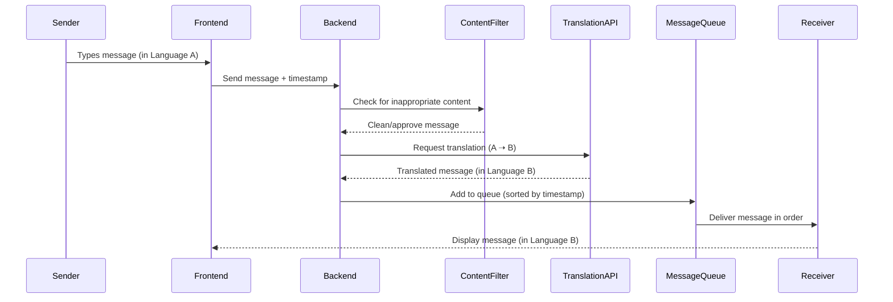

# Text Messaging Design

## Overview

Our text messaging web app allows two users to communicate in real time while viewing messages in their own preferred languages. This page is focused on how messages are sent and received between users

## 📈 Message Flow Diagram (Sender ➝ Receiver)

When a user sends a message, the frontend captures the content, language selection, and a precise timestamp. This timestamp is attached as metadata and used to ensure that messages are delivered and displayed in the order they were sent, even if network or translation delays occur. Messages are added to a queue on the backend, which is responsible for maintaining this ordering based on timestamp.

> **Note:** This moderation step can be deferred in the MVP.

Once approved, the message is passed to a translation API to convert it into the recipient’s chosen language. The translated message is then added to the queue. The system delivers messages to the receiver in timestamp order, ensuring a natural and consistent conversation flow. The receiver’s frontend then displays each message as if it were written natively in their own language.