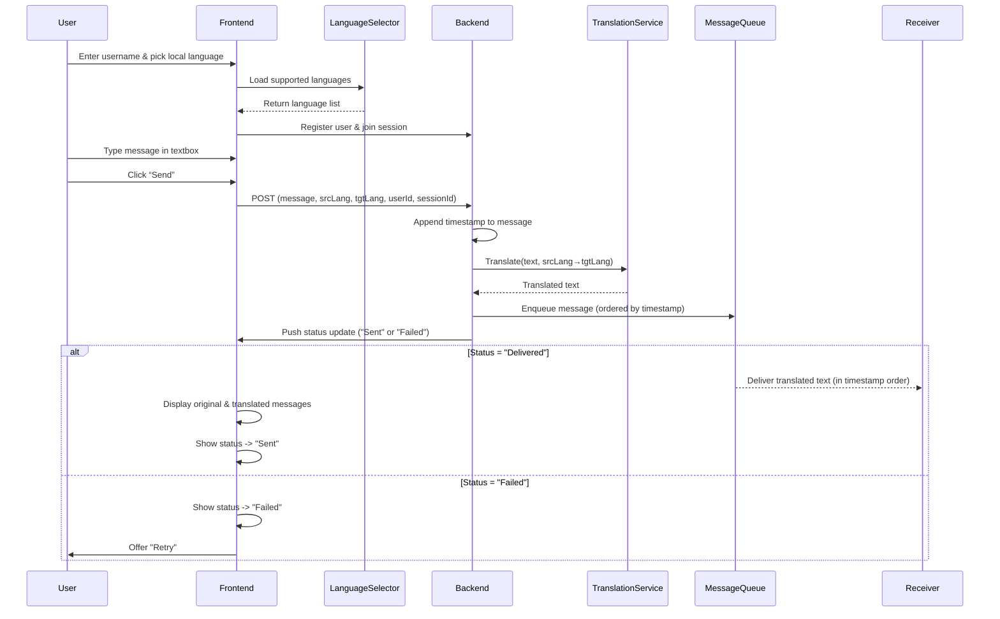

# Text Messaging Design

## Overview

Our messaging web app enables users to register with a username, select their preferred language, and join a session to message another user in real time. Messages are automatically translated on the backend and displayed side-by-side in their original and translated form once successfully sent.

## Message Flow Diagram (Sender ➝ Receiver)

When a user registers, the frontend records their username and selected language. When sending a message, the frontend captures the raw text, language metadata, and a precise timestamp. This timestamp is attached as part of the message metadata and is critical for preserving the correct message order, even when multiple messages are sent rapidly or processed at different speeds.

The frontend forwards this data to the backend, which decouples translation from the UI layer by invoking a third-party translation service. Once the translation is received, the backend enqueues both the original and translated message payloads into a message queue. This queue maintains ordering based on timestamps, ensuring that messages are delivered and displayed in the intended sequence.

After queue insertion, the backend emits a status update to the sender’s frontend. This update prompts the UI to render the original message alongside its translated counterpart or, in case of a failure, provide a retry option. On the receiver’s side, messages are pulled from the queue in timestamp order and displayed in their selected language, maintaining a smooth and coherent conversation experience.