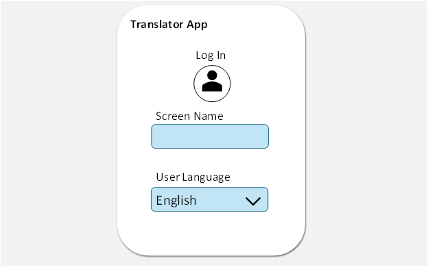
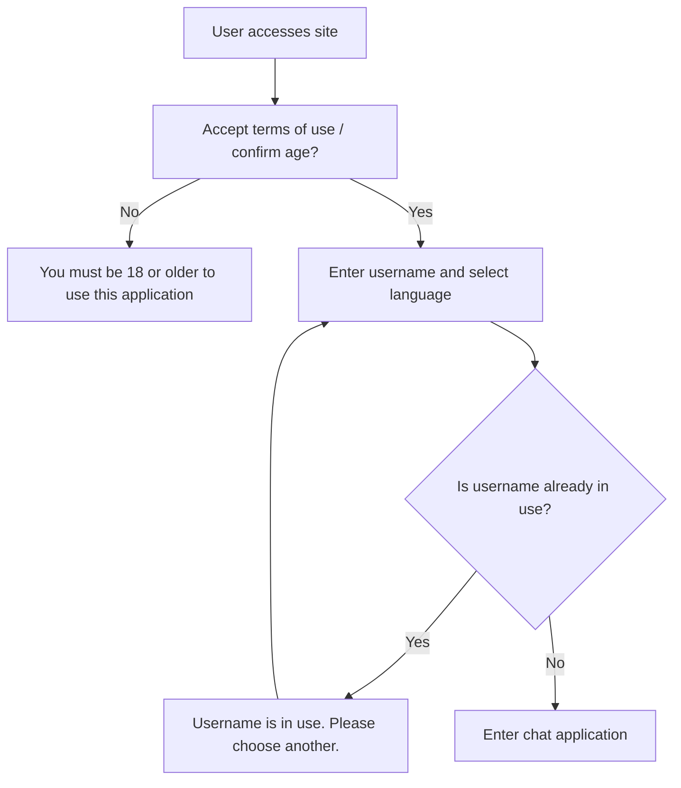
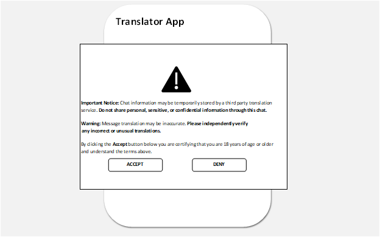
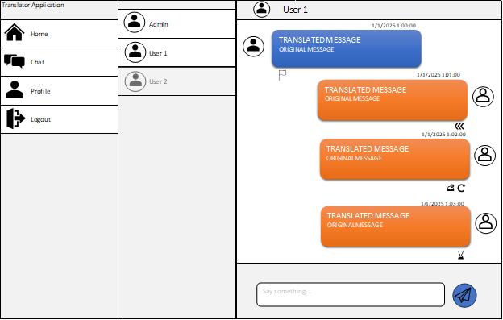
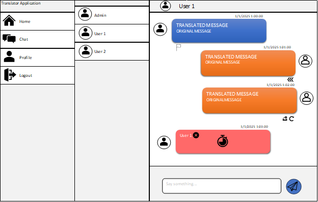
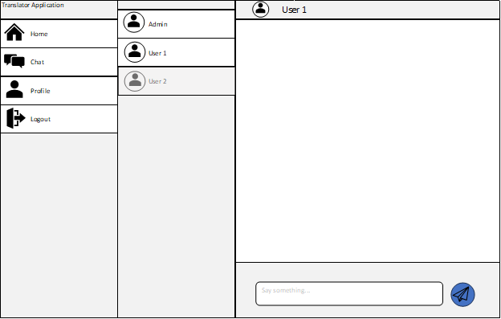

# Security Design  

## Functional Requirements  

| FR No | Description                                                                                                                  | Covered By             |
|-------|------------------------------------------------------------------------------------------------------------------------------|------------------------|
| 1     | Text shall only be able to be inputted in the text box                                                                       | Message UI             |
| 2     | Text shall only be sent when pressing the send button                                                                        | Message UI             |
| 3     | The users local screen shall show original message (source language) and the translated version (destination language)       | Message UI             |
| 4     | The sender shall be able to view the status of a message                                                                     | Message UI             |
| 5     | Messages that are successfully submitted to the backend system shall have a visible "sent" tag                               | Message UI             |
| 6     | Messages that are being processed through the system (sending, translation) shall be tagged as "In Progress"                 | Message UI             |
| 7     | Messages that failed to reach the backend system shall be tagged as "Failed"                                                 | Message UI             |
| 8     | Users shall have the ability to retry sending a failed message                                                               | Message UI             |
| 9     | The web application shall have a user setup, where the user picks a username as a unique identifier and their local language | User Setup             |
| 10    | Message can only be sent if more than one user is present in a session                                                       | Message UI             |
| 11    | The web application shall not store any user messages beyond the length of the session lifecycle                             | Cleared Session        |
| 12    | The application shall only allow alphanumeric characters and strings to be sent                                              | Message UI             |
| 13    | The application shall warn the user not to share private or sensitive information                                            | Warning                |
| 14    | The application should prevent unauthorized access to existing chat sessions                                                 | Message UI             |
| 15    | When a user leaves a chat, the session shall terminate for the other user                                                    | User Left Chat Session |

---

## User Setup

Since adding a full user registration system would be labor intensive, adding a new username and language setup for each use would keep our scope manageable.

## User Login Backend

## Warning

Warning popup alerts the user not to enter any sensitive information. A clause about any inaccurate translations has been added based on our risk analysis. This seems like a simple solution to mitigate against the identified risk.

## Message UI

This UI was copied from examples from similar Blazor Chat applications

- Three arrows indicates the message has been sent
- Inbox with X and Redo Icon indicates message not sent with option to resend
- Hourglass indicates message in transit
- User 2 is grayed out to indicate they are not active and therefore cannot be messaged
- Flag indicates that a message can be reported for inappropriate conduct per our ethics assessment. 

By using Icons as much as possible we can reduce the amount of work translating each word in our UI into different languages. 

## User Left Chat Session

Red chat bubble indicates that the other user has left, timer indicates that the session will end soon. 

## Cleared Session

Example of messages cleared after a session ends. 