# Universal Translator Chat Application - Architecture Documentation

## System Overview

The Universal Translator Chat Application is a real-time messaging platform that automatically translates messages between users speaking different languages. The system uses Azure Functions for serverless compute, Azure SignalR for real-time communication, and Azure Table Storage **only for group membership management**.

**Important**: This system does NOT store chat history or messages persistently - all communication happens in real-time through SignalR.

## High-Level Architecture

```mermaid
graph TB
    subgraph "Client Layer"
        VueJS[Vue.js Frontend<br/>Real-time Chat Interface]
    end
    
    subgraph "Azure Cloud Infrastructure"
        subgraph "Communication Layer"
            SignalR[Azure SignalR Service<br/>• Serverless Mode<br/>• Standard_S1<br/>• Real-time WebSocket connections]
        end
        
        subgraph "Serverless Compute"
            Functions[Azure Functions<br/>• .NET 8.0 Isolated<br/>• Flex Consumption Plan<br/>• User Management<br/>• Message Translation<br/>• SignalR Integration]
        end
        
        subgraph "Storage Layer"
            TableStorage[Azure Table Storage<br/>• Group Membership ONLY<br/>• User Language Preferences<br/>• ConnectionId Tracking<br/>• NO Message History]
            BlobStorage[Azure Blob Storage<br/>• Static Content<br/>• Function Binaries]
        end
        
        subgraph "AI Services"
            CognitiveServices[Azure Cognitive Services<br/>• Text Translation API<br/>• F0 Tier Free]
        end
    end
    
    VueJS <--> SignalR
    VueJS -->|HTTP API Calls| Functions
    Functions -->|Read/Write Membership| TableStorage
    Functions -->|Translate Messages| CognitiveServices
    Functions -->|Send Real-time Messages| SignalR
    Functions -->|Static Files| BlobStorage
    
    style VueJS fill:#4fc3f7
    style Functions fill:#66bb6a
    style SignalR fill:#ffa726
    style TableStorage fill:#ab47bc
    style BlobStorage fill:#9c27b0
    style CognitiveServices fill:#ef5350
```



## Message Flow Sequence


## Infrastructure Components (from Terraform)

```mermaid
graph TB
    subgraph "Resource Group: cse550-rg"
        subgraph "Compute Resources"
            ASP[Service Plan<br/>cse550-universal-translator-serviceplan<br/>• Linux OS<br/>• FC1 SKU]
            FA[Function App<br/>cse550-universal-translator-function-app<br/>• .NET 8.0 Isolated<br/>• Flex Consumption<br/>• Max 40 instances<br/>• 1GB memory]
        end
        
        subgraph "Communication"
            SR[SignalR Service<br/>cse550-universal-translator-signalr<br/>• Serverless mode<br/>• Standard_S1]
        end
        
        subgraph "Storage"
            SA[Storage Account<br/>cse550utstorage<br/>• Standard_LRS]
            BC[Blob Container<br/>cse550-ut-container<br/>• Private access]
            TS[Table Storage<br/>utchats<br/>• Group membership only]
        end
        
        subgraph "AI Services"
            CS[Cognitive Services<br/>cse550-universal-translator<br/>• TextTranslation<br/>• F0 Free SKU]
        end
    end
    
    FA --> ASP
    BC --> SA
    TS --> SA
    FA -.->|Uses| SR
    FA -.->|Uses| SA
    FA -.->|Calls| CS
```



## Azure Functions Endpoints

Based on the actual `Functions.cs` implementation:

### User Management Functions

- **`AddChatMember`** - `POST` 
  - Adds user to a chat group with language preference
  - Validates group membership uniqueness
  - Stores in Table Storage

- **`RemoveChatMember`** - `DELETE /removechatmember/{groupName}/{userId}`
  - Removes user from a chat group
  - Cleans up Table Storage entries

- **`GetChatMembers`** - `GET /getchatmembers/{groupName}`
  - Retrieves all members of a chat group
  - Returns user language preferences

- **`IsUserNameAvailable`** - `GET /isusernameavailable/{username}`
  - Checks username availability across all groups
  - Validates username format (2-50 characters)

### Messaging Functions

- **`SendMessageToUser`** - `POST`
  - Sends message with automatic translation between users
  - Validates group membership for both sender and recipient
  - Translates only if source/target languages differ
  - Sends real-time message via SignalR

## Data Storage Schema

### Table Storage: ChatMember Entity

```csharp
// From StorageService.cs - actual implementation
public class ChatMember : ITableEntity
{
    PartitionKey: GroupName     // e.g., "general-chat"
    RowKey: UserId             // e.g., "user123"
    
    Properties:
    ├── UserId: string         // User identifier
    ├── GroupName: string      // Chat group name
    ├── Language: string       // User's preferred language (e.g., "en", "es")
    ├── ConnectionId: string   // SignalR connection ID
    └── Timestamp: DateTimeOffset // Creation timestamp
}
```

**Critical Note**: Only group membership is stored. No chat history, messages, or conversation logs are persisted anywhere in the system.

## Message Translation Flow


## System Characteristics

### ✅ What the System DOES

- **Real-time 1-to-1 message translation** between users in the same group
- **Group membership management** with language preferences
- **Username availability checking** within the system
- **Live message delivery** via SignalR WebSocket connections
- **Automatic translation** only when source/target languages differ
- **Bidirectional translation** between any supported language pair

### ❌ What the System DOES NOT DO

- **Store chat history** or message persistence of any kind
- **Group chat/broadcast** messaging (only 1-to-1 messages)
- **Chatroom creation/deletion** management features
- **User authentication/authorization** beyond group membership validation
- **Message queuing** for offline users
- **File/media sharing** capabilities
- **Message editing** or deletion features

## Technology Stack Summary

| Component | Technology | Configuration | Purpose |
|-----------|------------|---------------|---------|
| Frontend | Vue.js | SPA | Real-time chat interface |
| API Gateway | Azure Functions | .NET 8.0 Isolated | HTTP endpoints + SignalR integration |
| Real-time Messaging | Azure SignalR | Serverless, Standard_S1 | WebSocket connections |
| Translation | Azure Cognitive Services | TextTranslation F0 | Language translation API |
| Data Storage | Azure Table Storage | Standard_LRS | Group membership only |
| Static Hosting | Azure Blob Storage | Standard_LRS | Vue.js app files |
| Infrastructure | Terraform | IaC | Resource provisioning |

## Key Architecture Decisions

### 1. **No Message Persistence**
- Messages are translated and delivered in real-time only
- No chat history, logs, or message storage
- Reduces complexity and storage costs
- Ensures privacy (no permanent message records)

### 2. **1-to-1 Messaging Model** 
- Each message targets a specific user, not broadcast to group
- Enables personalized language translation per recipient
- Simpler than group chat with multiple language support

### 3. **Table Storage for Membership Only**
- Lightweight storage for user-group-language mapping
- Fast lookups by group name (PartitionKey)
- No complex relational data requirements

### 4. **Serverless Architecture**
- Azure Functions scale automatically (0-40 instances)
- Pay-per-execution pricing model
- No server management overhead
- SignalR serverless mode for cost optimization

This architecture provides a focused, efficient solution for real-time message translation between users without the complexity of persistent chat features.
