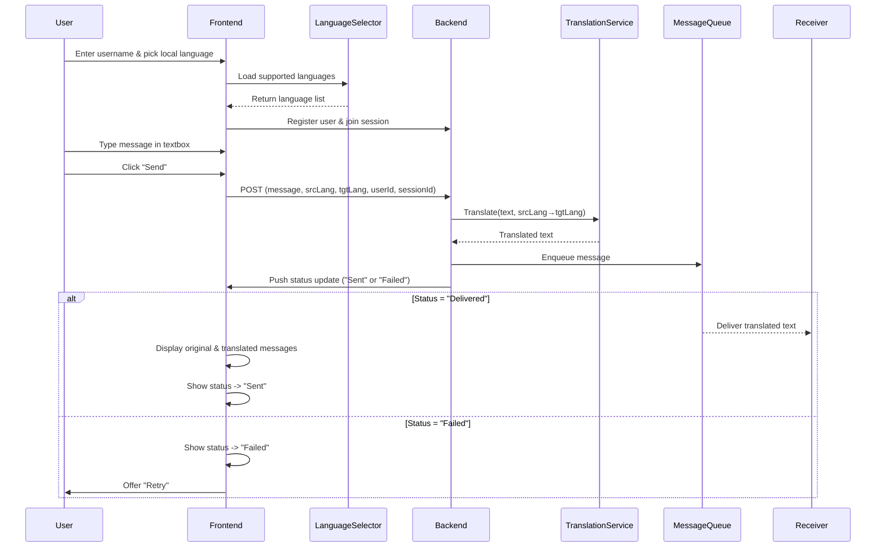

# Language Translation Design
---
## Overview:
---
Our messaging web app enables users to register with a username, select their preferred language, and join a session. Messages are automatically translated on the backend and displayed side-by-side in their original and translated form once successfully sent.
## Translation Flow Diagram (Sender -> Receiver)
---

When a user registers, the frontend records their username and chosen language. Upon sending a message, the UI forwards the raw text and language metadata to the backend, which decouples translation from the UI layer by invoking a third-party translation service and enqueuing both original and translated payloads in a queue.

After translation and queue insertion, the backend emits a status update, prompting the frontend to render the original and translated text together or display a retry option. The receiver then receives the translated message from the queue in order, ensuring a consistent and natural conversation flow in their selected language.
